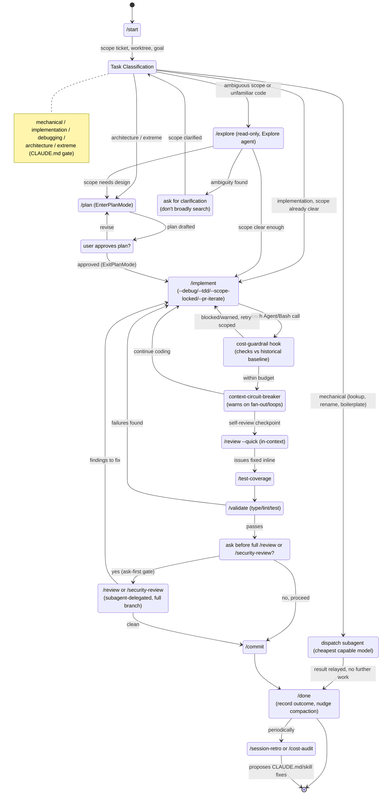

# AI Assistant Starter

Reusable skills for AI coding assistants, following the [Agent Skills specification](https://agentskills.io/specification).

## Why This Exists

AI coding assistants work better with structured guidance. This collection provides:

- **Workflow skills** for common tasks (implement, debug, refactor, commit)
- **Domain guidelines** for consistent code style across your team
- **Approval gates** to prevent unintended changes
- **Background knowledge** auto-loaded when relevant

## Installation

All 36 skills are distributed as a single Claude Code plugin,
`ai-assistant-starter`, at `plugins/ai-assistant-starter/`. 5 additional
harness-level runtime hooks (see "Runtime Hooks" below) ship alongside them —
they're plumbing the plugin wires in, not skills. Install by adding this repo
as a marketplace, then installing the plugin:

```bash
# Clone the repo (as a sibling of your project, or anywhere on disk)
git clone https://github.com/hypefi/ai-assistant-starter.git

# Register this repo as a plugin marketplace
claude plugin marketplace add ./ai-assistant-starter

# Install the plugin (installs every skill; there is no per-skill selection)
claude plugin install ai-assistant-starter
```

Installing the plugin also wires up its runtime hooks —
`branch-protection`, `destructive-command-protection`,
`context-circuit-breaker`, `cost-guardrail`, and `prompt-context-router` —
so those protections are active immediately, with no separate setup step.

Skills become available as `/name` commands as soon as the plugin is
installed.

## Skills

## Ideal Cost-Optimized Workflow

This state machine synthesizes the skills above into one cost-aware workflow: classify every task before acting, route mechanical work to the cheapest model, and gate expensive steps (full review, subagent fan-out) behind explicit checks rather than defaults.



**Cost-optimization logic embedded in the graph:**
- Every task hits `Classify` first — mechanical work routes straight to `Dispatch` (cheapest model), never touches Plan/Implement.
- `cost-guardrail` and `context-circuit-breaker` sit inline on every Agent/Bash call during `Implement`, not just at boundaries.
- `--quick` review runs in-context before the expensive, subagent-delegated full `/review`/`/security-review` — the costly path is ask-first, not default.
- `/session-retro` and `/cost-audit` close the loop by feeding waste patterns back into CLAUDE.md/skills.

### Development Workflows

| Skill | Purpose |
|-------|---------|
| `/start` | Scope a new work session to a ticket, worktree, and goal, auto-triggering on session start |
| `/explore` | Understand code (read-only) |
| `/plan` | Design approach before coding |
| `/implement` | Execute an approved plan — code, self-review, test, validate, commit, close. Selectable modes (`--debug`, `--tdd`, `--scope-locked`, `--pr-iterate`) handle debugging, strict TDD, scope-locked autonomous work, and PR-feedback iteration.
| `/refactor` | Multi-file changes with tracking |
| `/stack` | Split a large branch into a resumable series of stacked PRs |

### Quality & Testing

| Skill | Purpose |
|-------|---------|
| `/validate` | Run type check, lint, tests |
| `/test-coverage` | Ensure test coverage for changes |
| `/e2e` | End-to-end testing with Playwright/Cypress |
| `/review` | Review current branch against base; `--quick` mode for use as a sub-step within `/implement` or `/done`
| `/security-review` | Systematic security audit with confidence-based reporting |

### Git & Release

| Skill | Purpose |
|-------|---------|
| `/commit` | Review and commit with confirmation |
| `/done` | Close out a session — test coverage, review, validation gate, commit, create/update the PR, record the outcome. Works standalone or for a `/start`-opened session.
| `/release` | Version bump, changelog, and tagging |

### Utilities

| Skill | Purpose |
|-------|---------|
| `/deps` | Audit, update, and manage dependencies |
| `/sync` | Align documentation with codebase |
| `/add-story` | Create Storybook stories |
| `/add-todo` | Document deferred work |
| `/cost-audit` | Audit Langfuse traces for token-cost waste and propose evidence-backed fixes |
| `/session-retro` | Analyze the current session for behavioral issues and propose fixes plus prompt tips |
| `/tooling-audit` | Audit installed plugins, MCP servers, skills, and permissions against usage evidence |

### Bootstrap & Setup

Run once when adopting or upgrading the assistant on a project, not during day-to-day coding:

| Skill | Purpose |
|-------|---------|
| `/init` | Bootstrap project configuration |
| `/apply-template` | Apply the standardized CLAUDE.md template (task classification, search-relevance, process hygiene) to an existing installation, with opt-in companion READMEs and circuit-breaker/cost-guardrail/prompt-context-router hooks |

### Runtime Hooks (not skills)

These live under `hooks/<name>/`, not `skills/` — they're plain scripts the harness
invokes directly via `plugins/ai-assistant-starter/hooks/hooks.json`, never
instructions Claude reads or executes. Each `hooks/<name>/README.md` documents
its exact trigger conditions and configuration:

- **branch-protection** — Blocks force-push, hard reset, branch deletion on main/master
- **destructive-command-protection** — Blocks rm -rf /, DROP DATABASE, and other destructive commands
- **context-circuit-breaker** — Warns (never blocks) on subagent fan-out and expensive-call loops
- **cost-guardrail** — Warns or blocks Agent spawns and Bash calls whose historical cost is disproportionate to the cheapest tracked model tier, using baselines cost-audit refreshes
- **prompt-context-router** — Classifies each prompt by task class and topic-pivot, and advises treating clear asides as standalone (with a delegation suggestion for cheap ones) instead of re-deriving them from the full session history

### Background Skills (auto-loaded)

These are loaded automatically when relevant — no slash command needed:

- **ai-assistant-protocol** — Core execution protocol, code quality, testing requirements
- **git-conventions** — Branch naming, commit messages, workflow patterns
- **security-guidelines** — OWASP top 10, input validation, XSS prevention
- **documentation-guidelines** — When and how to comment code
- **communication-guidelines** — Response formatting and status indicators
- **code-review-guidelines** — Review checklist and feedback patterns
- **interaction-boundaries** — Human-AI interaction boundaries, non-anthropomorphic communication
- And more: GitHub Actions, logging, naming, performance, error handling, environment config

## How It Works

```
Explore → Plan → [Approval] → Code → Test → Validate → Review → [Confirm] → Commit
```

The skills enforce a disciplined workflow:
- **Explore before coding** — understand the codebase first
- **Plan before implementing** — design the approach
- **Test coverage required** — all code changes need tests
- **Validate before commit** — type check, lint, tests must pass
- **Review before merge** — self-review catches issues
- **Confirm before commit** — explicit user approval required

## Project Setup

After installing skills, run `/init` to scaffold project-specific configuration:

```
your-project/
├── .claude/skills/          # Installed skills
├── CLAUDE.md                # Project context (tech stack, conventions)
└── .ai-project/             # Project state (created by /init)
    ├── .memory.md           # Architecture overview
    ├── .context.md          # Patterns and imports
    ├── config.yaml          # Structured settings with defaults
    ├── project/             # Project configuration
    │   ├── commands.md      # Build/test/lint commands
    │   ├── structure.md     # Directory layout
    │   ├── patterns.md      # Code patterns and conventions
    │   └── stack.md         # Technology stack
    ├── domains/             # Stack-specific domain rules
    │   └── *.instructions.md
    ├── todos/               # Technical debt tracking
    ├── decisions/           # Architecture decision records
    └── history/             # Work history
```

The system uses two layers, with project-specific context taking precedence:

| Layer | Source | Purpose |
|-------|--------|---------|
| **Base skills** | `skills/<name>/SKILL.md` | Reusable workflows and domain guidelines |
| **Project context** | `.ai-project/` | Project-specific overrides, patterns, and state |

`/init` detects your tech stack from `package.json` and config files, generates project-specific context, copies relevant domain instruction files, and creates a `CLAUDE.md` with project-level instructions.

To add project-specific domain rules, create files in `.ai-project/domains/`:

```markdown
<!-- .ai-project/domains/my-api.instructions.md -->
# My API Conventions

- All endpoints return `{ data, error, meta }` envelope
- Use `zod` for request validation
- Rate limiting: 100 req/min per API key
```

## Specification Compatibility

Skills follow the [Agent Skills specification](https://agentskills.io/specification):

- Each skill is a directory containing a `SKILL.md` file with YAML frontmatter
- Required fields: `name` (matches directory name), `description`, `category`
- Progressive disclosure: metadata loaded at startup, full instructions on activation
- Optional `references/` and `assets/` directories for supplementary content

Background skills use `user-invocable: false` in frontmatter — a runtime extension not part of the base spec.

## Updating

```bash
# Pull the latest changes
cd ai-assistant-starter
git pull

# Update the marketplace and the plugin in your project
claude plugin marketplace update ai-assistant-starter
claude plugin update ai-assistant-starter

# Then refresh project config
/init --update
```

## Further Reading

- [Cost Optimization](docs/cost-optimization.md) — reference setup for reducing Claude Code token/dollar spend (command filtering hooks, model-tier routing, context hygiene)

## Third-Party Notices

This project includes content derived from third-party sources including WCAG 2.1 (W3C, CC BY 4.0), Conventional Commits (CC BY 3.0), and OWASP Top 10 (CC BY-SA 4.0). See [THIRD_PARTY_NOTICES.md](THIRD_PARTY_NOTICES.md) for full attribution details.

## License

MIT
